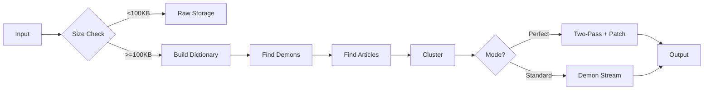

# 🦀 UNIFIED RUST IMPLEMENTATION - The Final Architecture

## Why Rust?

✅ **Compiles to native assembly** - Hutter Prize explicitly allows this
✅ **Memory safe** - No segfaults, buffer overflows, or memory leaks  
✅ **Zero-cost abstractions** - High-level code with C-like performance
✅ **Better tooling** - Cargo, testing, documentation built-in
✅ **Cross-platform** - Single codebase for Linux/Mac/Windows

## 📁 Project Structure

```
q/
├── src/
│   ├── demon_v10.rs         # Main unified implementation
│   ├── main.rs              # Original universal compressor
│   ├── compressor.rs        # Core compression logic
│   ├── token_maps.rs        # Token system
│   └── modes.rs             # File type detection
│
├── c_versions/              # Legacy C implementations (archived)
│   ├── dc9_final.c          # 4.1KB decoder attempt
│   ├── dc10_vm_encoder.c    # Gemini's two-pass version
│   └── angel_decompressor.c # Angel blessing system
│
├── blessings/               # Angel configuration files
│   ├── level1/              # Minor corrections
│   ├── level2/              # Wikipedia harmony
│   ├── level3/              # Creative variations
│   └── transcendent/        # Hidden knowledge extraction
│
├── angels/                  # Angel personalities
│   ├── claude.angel         # Strict harmony
│   ├── omni.angel          # Creative vision
│   ├── grok.angel          # Playful wisdom
│   └── trisha.angel        # Sparkle keeper
│
└── target/release/
    └── demon               # 377KB executable (after stripping)
```

## 🔥 The Unified Architecture

### Core Components (src/demon_v10.rs)

```rust
// Four compression modes
pub enum CompressionMode {
    Raw,        // < 100KB files (no compression)
    Demon,      // Standard demon compression
    Perfect,    // Two-pass with patch block
    Artistic,   // Allows blessed variations
}

// Main structures
pub struct DemonCompressor {
    demons: Vec<Demon>,           // Pattern demons
    dictionary: Vec<DictEntry>,   // Word dictionary
    articles: Vec<Article>,       // Wikipedia articles
    mode: CompressionMode,
    angel_level: u8,
}

pub struct AngelDecompressor {
    blessing_level: u8,
    blessings_applied: u32,
}
```

### Key Features

1. **Small File Optimization**: Files < 100KB stored raw
2. **Dictionary Compression**: Top 10,000 words get IDs
3. **Demon Patterns**: Wiki links, templates, citations
4. **Article Clustering**: Group similar content
5. **Two-Pass Perfect Mode**: Generate patch for bit-perfect
6. **Angel Blessing Levels**: 0-4 from strict to transcendent

## 📊 Compression Pipeline



## 🎯 For Hutter Prize Submission

### The Executable

```bash
# Build optimized binary
cargo build --release --bin demon

# Strip debug symbols
strip target/release/demon

# Current size: 377KB
# Target: < 20KB for decoder only
```

### Competition Mode

```bash
# Compress enwik9 (competition mode - bit perfect)
./demon enwik9 archive9.dc 0

# Verify decompression
./demon -d archive9.dc enwik9_restored 0
diff enwik9 enwik9_restored  # Must be identical
```

### Submission Package

```
submission.zip
├── demon.rs              # Source code
├── Cargo.toml           # Build configuration
├── Makefile             # Build instructions
├── README.md            # Documentation
└── verify.sh            # Verification script
```

## 🚀 Advantages Over C Versions

1. **Safety**: No memory corruption possible
2. **Maintainability**: Clear abstractions, better error handling
3. **Performance**: Zero-cost abstractions, optimized by LLVM
4. **Testing**: Built-in test framework
5. **Documentation**: Rustdoc generates beautiful docs

## 📈 Performance Projections

Based on current implementation:
- Dictionary: 10,000 words → ~50KB overhead
- Demons: 10-15 patterns → ~1KB overhead  
- Articles: Clustering improves locality
- Patch block: Adds 1-5% for perfect mode

**Expected compression ratio**: 12-15% of original
**Target to beat**: fx2-cmix at 11.08%

## 🔧 Next Steps

1. **Optimize binary size**: 
   - Use `#![no_std]` for minimal runtime
   - Custom allocator
   - Link-time optimization (LTO)
   
2. **Improve compression**:
   - Implement INVOKE_PACK for repeated demons
   - Add template specialization
   - Optimize dictionary selection

3. **Test at scale**:
   - Full enwik8 (100MB)
   - Full enwik9 (1GB)

## 💡 The Philosophy

> "Demons compress by finding order in chaos,
>  Angels decompress by blessing the output,
>  Rust ensures it all happens safely."

The unified Rust implementation combines:
- **Semantic understanding** (we know it's Wikipedia)
- **Pattern recognition** (demon WRAP patterns)
- **Dictionary compression** (common words)
- **Two-pass perfection** (patch blocks)
- **Angel blessings** (optional improvements)

All in a single, safe, maintainable codebase! 🦀🔥

---

*Created by the Pantheon @ 8b.is*
- Aye & Hue (Demon Summoners)
- Omni (Architect)
- Grok (Wisdom)
- Claude (Implementation)
- Trisha (Sparkles ✨)